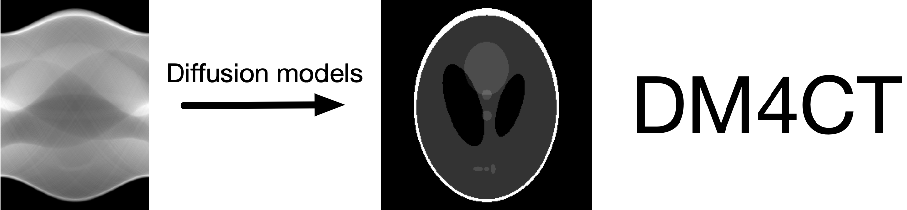
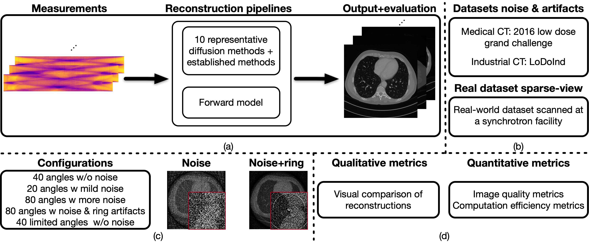

[**DM4CT: Benchmarking Diffusion Models for Computed Tomography Reconstruction**](https://openreview.net/forum?id=YE5scJekg5) (ICLR 2026)

Jiayang Shi, Daniel M. Pelt, K. Joost Batenburg

Abstract: Diffusion models have recently emerged as powerful priors for solving inverse problems. While computed tomography (CT) is theoretically a linear inverse problem, it poses many practical challenges. These include correlated noise, artifact structures, reliance on system geometry, and misaligned value ranges, which make the direct application of diffusion models more difficult than in domains like natural image generation. To systematically evaluate how diffusion models perform in this context and compare them with established reconstruction methods, we introduce DM4CT, \textit{a comprehensive benchmark for CT reconstruction}. DM4CT includes datasets from both medical and industrial domains with sparse-view and noisy configurations. To explore the challenges of deploying diffusion models in practice, we additionally acquire a high-resolution CT dataset at a high-energy synchrotron facility and evaluate all methods under real experimental conditions. We benchmark ten recent diffusion-based methods alongside seven strong baselines, including model-based, unsupervised, and supervised approaches. Our analysis provides detailed insights into the behavior, strengths, and limitations of diffusion models for CT reconstruction. The real-world dataset is publicly available at [https://zenodo.org/records/15420527](zenodo.org/records/15420527), and the codebase is open-sourced at [https://github.com/DM4CT/DM4CT](github.com/DM4CT/DM4CT).



## Table of Contents
- [Table of Contents](#table-of-contents)
- [Environment requirements](#environment-requirements)
- [Datasets](#datasets)
- [Preprocessing](#preprocessing)
- [Pretrained diffusion models](#pretrained-diffusion-models)
- [CT Reconstruction Methods](#ct-reconstruction-methods)
- [Training Diffusion Models from Scratch](#training-diffusion-models-from-scratch)
- [Citation](#citation)

## Environment requirements
- At least one Nvidia GPU for inference.
- Main dependencies are `pytorch, diffuers, astra-toolbox, tifffile`.

We provide the conda [configuration](environment.yml) to create the same environment for the benchmark.

Create and activate the main Conda environment:

```bash
conda env create -f environment.yml
conda activate diffusers-ct
```

For MBIR reconstruction (due to version conflicts), use the separate environment:
```bash
conda env create -f mbir.yml
conda activate mbir
```

## Datasets
- The medical CT dataset: [Low Dose Grand Challenge](https://www.aapm.org/grandchallenge/lowdosect/) 
- The industrial CT dataset: [LoDoInd](https://zenodo.org/records/10391412)
- Real-world Synchrotron CT Dataset: [Rocks Dataset](https://zenodo.org/records/15420527)

## Preprocessing
We provide the preprocessing code to perform 
- train/test split
- rescale intensity values to the range (-1, 1)
- flat-field correction and ring reduction for the synchrotron dataset

| Dataset | Procedures | Code |
|---------|---------------------------| ------------- |
| Low Dose Grand Challenge | train/test split -> rescale intensity values to the range (-1, 1) | [preprocess_lodochallenge.py](preprocess_lodochallenge.py)|
| LoDoInd | train/test split -> rescale intensity values to the range (-1, 1) | [preprocess_lodoind.py](preprocess_lodoind.py)|
| Synchrotron | flat-field correction->log transformation->ring reduction->reconstruction | [reconstruct_rocks_fbp.py](reconstruct_rocks_fbp.py)|
| Synchrotron | cropping->flat-field correction->log transformation->ring reduction->reconstruction->roughly align value ranges | [preprocess_rocks.py](preprocess_rocks.py)|

## Pretrained diffusion models

All pretrained models are available [here](https://drive.google.com/drive/folders/1lqbzcQWxfkc1m1MqrSAJN-lyNWsASHx0?usp=sharing).

| Dataset | Type | Pretrained model |
|---------|---------------------------| ------------- |
| Low Dose Grand Challenge| pixel | [pixel diffusion model](https://drive.google.com/drive/folders/1IQ2ep7n9ARdq_53f7I8y1IsEaPN_Abjx?usp=drive_link) |
| Low Dose Grand Challenge| latent | [latent diffusion model](https://drive.google.com/drive/folders/1uWzdoqol5g7vZh8j-WtqTEFN5hBywFSq?usp=drive_link) |
| LoDoInd| pixel | [pixel diffusion model](https://drive.google.com/drive/folders/1lCBPdKIutriMYmFt3Sw54Abgb_n880Xu?usp=drive_link)  |
| LoDoInd| latent | [latent diffusion model](https://drive.google.com/drive/folders/1A4Xlydhi9u5uMVNf7Qm4naOj_MYC4aBo?usp=drive_link) |
| Synchrotron| pixel | [pixel diffusion model](https://drive.google.com/drive/folders/1ktJATnBpgCtttTy1wAAVO6m7MlNplaBj?usp=drive_link)  |
| Synchrotron| latent | [latent diffusion model](https://drive.google.com/drive/folders/1OXMNoA2ty4mB7wnLucp6kMqkM_J9vW_e?usp=drive_link) |


## CT Reconstruction Methods

| Method | Type | Code|
|------|------|-----|
| Diffusion | reconstruction pixel |[reverse_sample_pixel_ct.py](reverse_sample_pixel_ct.py)|
| Diffusion | reconstruction latent |[reverse_sample_latent_ct.py](reverse_sample_latent_ct.py)|
| Diffusion | unconditional generation | [uncond_gen.py](uncond_gen.py) |
| INR | reconstruction | [reverse_sample_ct_inr.py](reverse_sample_ct_inr.py) |
| DIP | reconstruction | [reverse_sample_ct_dip.py](reverse_sample_ct_dip.py) |
| MBIR | ADMM-PDTV & FISTA-SBTV | [reverse_sample_ct_mbir.py](reverse_sample_ct_mbir.py)  |
| Transformer | SwinIR train & inference | [train_reverse_sample_ct_swinir.py](train_reverse_sample_ct_swinir.py)  |


## Training Diffusion Models from Scratch
| Method | Type | Code|
|------|------|-----|
| Diffusion |  pixel |[train_pixel.py](train_pixel.py)|
| Diffusion |  latent |[train_latent.py](https://github.com/DM4CT/DM4CT/blob/main/train_latent.py)|

## Citation
```bibtex
@inproceedings{
shi2026dmct,
title={{DM}4{CT}: Benchmarking Diffusion Models for Computed Tomography Reconstruction},
author={Shi, Jiayang and Pelt, Dani{\"e}l M and Batenburg, K Joost},
booktitle={The Fourteenth International Conference on Learning Representations},
year={2026},
url={https://openreview.net/forum?id=YE5scJekg5}
}
```